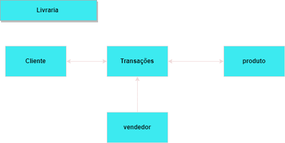
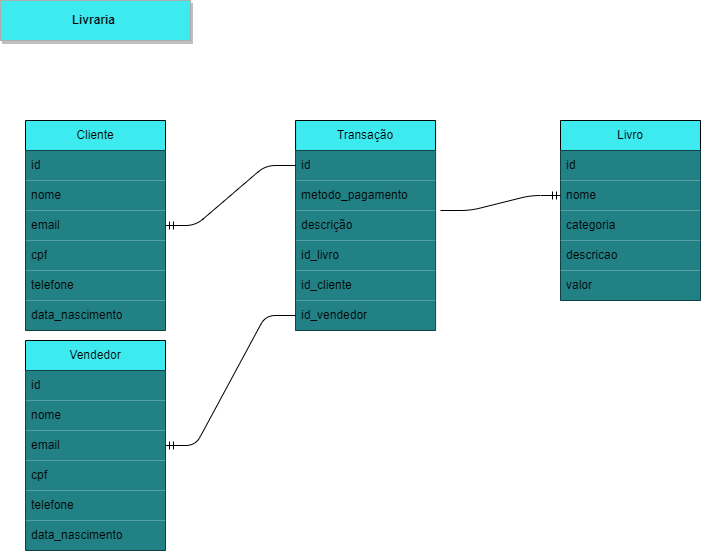
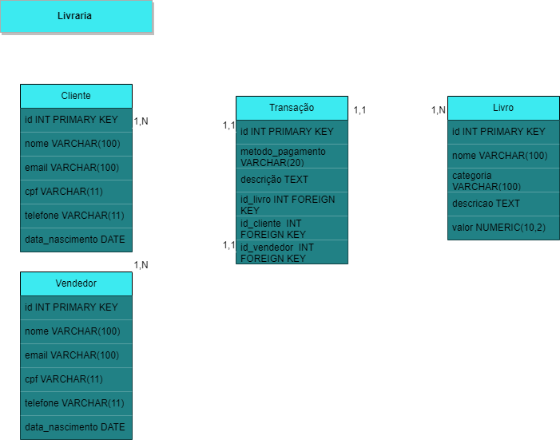

# Manipulating fake sales data from a bookstore 📚

In this repository we will do a slightly more complex exercise.
We will create a fake datalake from a bookstore.
If you want to follow the step-by-step process of creating the data, I will explain it here.

### Data Modeling

<details>
  <summary> <b>Conceptual modeling 🔎</b></summary>

  

  </details>

<details>
<summary> <b>Logical modeling 🔎</b></summary>



  </details>

<details>
<summary> <b>Physical modeling 🔎</b></summary>



  </details>


### Contents

- [`docker-compose.yml`](docker-compose.yml)-file for configuring Docker containers
- [`/SQL`](/sql) - directory contains SQL scripts for manipulating the fake sales data in the bookstore project.
- [`popular-tabelas.py`](popular-tabelas.py) - script for populating tables in the bookstore project.
- [`data_extract.py`](data_extract.py) -script to extract sql data, convert to csv to create the datalake

### Running the scripts

1. Run the docker compose file in the terminal
```
docker compose up
```
2. Install requirements via pip in the terminal
```
pip install requeriments.txt
```
3. Execute os scripts python no terminal
 ##### popular-tabelas
```
python popular-tabelas.py
```
##### Data Extract
```
python data_extract.py
```
#### Data created in mysql!

### Now let's analyze the data in the juptyter file below

- [spark_sql_analizing.ipynb](spark_sql_analizing.ipynb)

[Descrição em Português](README_PT.md)

| <a  href="https://www.linkedin.com/in/victor-breia/">  |<h1> [Victor Breia](https://www.linkedin.com/in/victor-breia/)</a>                                                                      </h1>                                                                                                                                                                                    |
| ----------------------------------------------------------------------------------------------------------------------------------------------------------------------------------------------------------------------------- | ---------------------------------------------------------------------------------------------------------------------------------------------------------------------------------------------------------------------------------------------------------------------------------------------------------------------- |
| Contate-me:                                                                                                                                                                                                                   | [](https://www.linkedin.com/in/victor-breia/) [](mailto:victordaschagas@outlook.com) |
