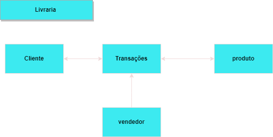
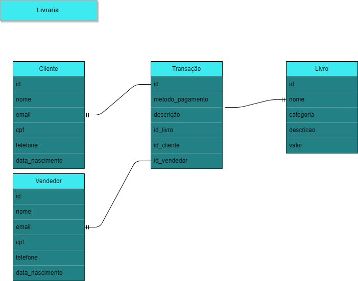
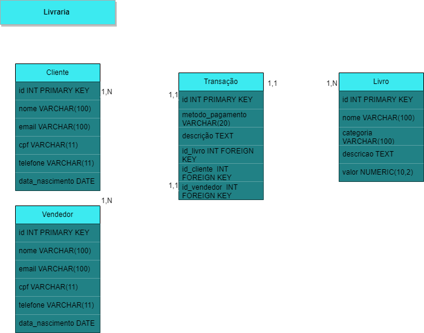

# Manipulando dados "fake" de vendas de uma livraria 📚

Neste repositório faremos um exercício um pouco mais complexo.
Criaremos um datalake falso de uma livraria.
Se você quiser seguir o passo a passo de criação dos dados, explicarei aqui.

### Modelagem de dados

<details>
  <summary> <b>Modelagem Conceitual 🔎</b></summary>

  

  </details>

<details>
<summary> <b>Modelagem Lógica 🔎</b></summary>



  </details>

<details>
<summary> <b>Modelagem Física 🔎</b></summary>



  </details>


### Conteúdo

- [`docker-compose.yml`](docker-compose.yml)-arquivo para configurar contêineres Docker
- [`/SQL`](/sql) - diretório contém scripts SQL para manipular os dados de vendas falsos no projeto da livraria.
- [`popular_tabelas.py`](popular_tabelas.py) - script para preenchimento de tabelas no projeto livraria.
- [`data_extract.py`](data_extract.py) -script para extrair dados sql, converter para csv para criar o datalake

### Executando os scripts

1. Execute o arquivo docker compose no terminal
```
docker compor
```
2. Instale os requisitos via pip no terminal
```
requisitos de instalação do pip.txt
```
3. Execute scripts python no terminal
 ##### tabelas populares
```
python tabelas populares.py
```
##### Extração de dados
```
python data_extract.py
```
#### Dados criados em mysql!

### Agora vamos analisar os dados no arquivo juptyter abaixo

- [spark_sql_analizing.ipynb](spark_sql_analizing.ipynb)


[Descrição em Inglês](README.md)

| <a  href="https://www.linkedin.com/in/victor-breia/">  |<h1> [Victor Breia](https://www.linkedin.com/in/victor-breia/)</a>                                                                      </h1>                                                                                                                                                                                    |
| ----------------------------------------------------------------------------------------------------------------------------------------------------------------------------------------------------------------------------- | ---------------------------------------------------------------------------------------------------------------------------------------------------------------------------------------------------------------------------------------------------------------------------------------------------------------------- |
| Contate-me:                                                                                                                                                                                                                   | [](https://www.linkedin.com/in/victor-breia/) [](mailto:victordaschagas@outlook.com) |
